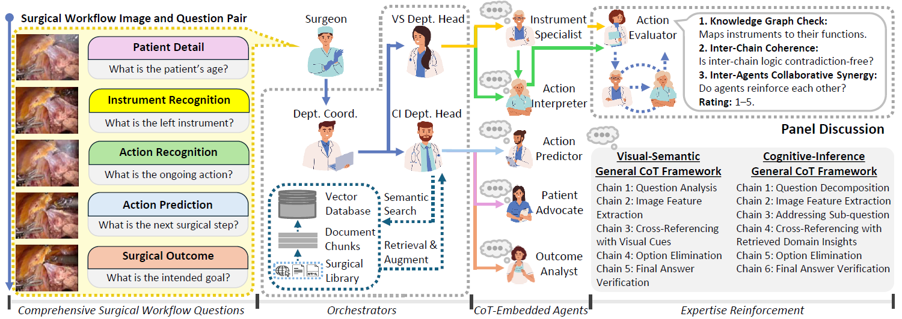
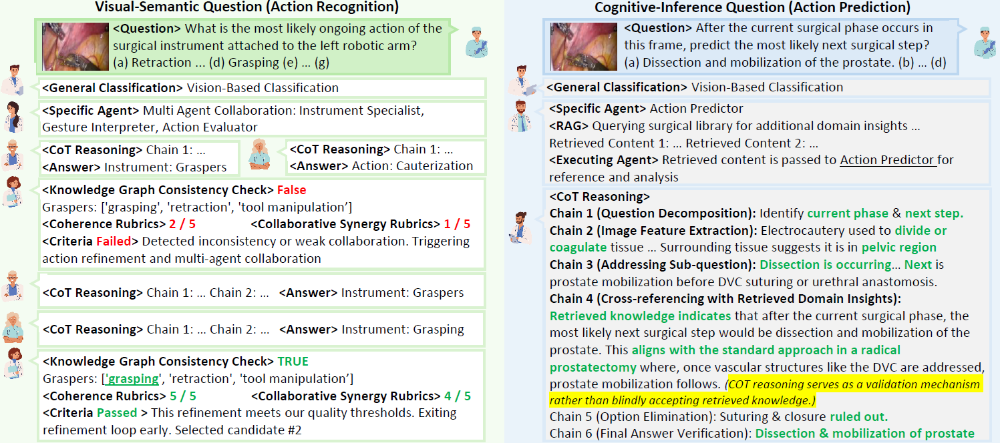
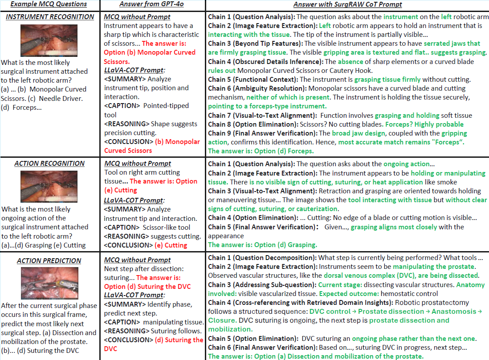

# SurgRAW:**Multi-Agent Workflow with Chain-of-Thought Reasoning for Surgical Intelligence**

The official repository for **SurgRAW**, a Chain-of-Thought-driven, multi-agent framework delivering transparent and interpretable insights for robotic-assisted surgery.

> **Note:** The full codebase and dataset will be released soon.

---

## 🔍 Overview

  

SurgRAW employs **specialized prompts** and a **hierarchical orchestration system** across **five core surgical intelligence tasks**:

1. **Instrument Recognition**
2. **Action Recognition**
3. **Action Prediction**
4. **Patient Data Extraction**
5. **Outcome Assessment**

### Key Features
- **Chain-of-Thought Agents** – Task-specific prompts guide VLM agents through structured reasoning, reducing hallucinations and improving explainability.  
- **Hierarchical Orchestration** – A Department Coordinator routes queries to visual-semantic or cognitive-inference agents, mirroring real surgical workflows.  
- **Panel Discussion** – An Action Evaluator cross-checks visual-semantic predictions using a knowledge graph and rubric-based evaluation for logical consistency.  
- **Retrieval-Augmented Generation (RAG)** – Cognitive-inference tasks are grounded in external medical knowledge for reliable, domain-specific responses.

 
---

## 📊 SurgCoTBench Dataset

We evaluate SurgRAW on **SurgCoTBench** — the first reasoning-based dataset covering the entire surgical workflow.

- **12 robotic procedures**
- **2,277 frames**
- **14,176 vision–query pairs**
- **5 task categories** aligned with the SurgRAW framework

**Release Plan:** SurgCoTBench and the corresponding Chain-of-Thought prompts will be made available with our paper.  
You may also use SurgCoTBench or any dataset that includes the following columns in its `.xlsx` file:

- `image_path`
- `question`
- `ground_truth`

---

## 📌 Current Status

This repository currently showcases:
- The **SurgRAW agentic framework** architecture  
- **Collaboration metrics**  

Dataset and full CoT prompt releases will follow publication. Collaborations are warmly welcomed.

---

## 🖼 Case Studies 


---

## 📚 Citation

If you find this work useful, please cite our paper:

```bibtex
@article{low2025surgraw,
  title={Surgraw: Multi-agent workflow with chain-of-thought reasoning for surgical intelligence},
  author={Low, Chang Han and Wang, Ziyue and Zhang, Tianyi and Zeng, Zhitao and Zhuo, Zhu and Mazomenos, Evangelos B and Jin, Yueming},
  journal={arXiv preprint arXiv:2503.10265},
  year={2025}
}
